# GIS概論

## この資料について

本資料は2018年9月19日に行われた奈良文化財研究所「遺跡情報記録課程」の「GIS演習」で使用した解説資料です。

## マスターすること

GISとはどのようなものか、GISを利用するメリットやGISを利用する上での基礎知識を学びます。

- GISとは何か
- GISにできること
- ベクタとラスタ
- 測地系と投影系、座標系
- 発掘調査と世界測地系
- GISに関するアンケート

## ドキュメント

- [配布資料](https://github.com/IshiiJunpei/QGISforArcIntroduction/blob/master/01GIS%E6%A6%82%E8%AB%96.pdf)
- [スライド](https://IshiiJunpei.github.io/QGISforArcIntroduction)

----
# GIS概論
 
 Created by Ishii Junpei ( [@ishiijunpei](https://twitter.com/ishiijunpei))

## 「GIS」とは

空間的な情報の取り扱いについてコンピュータを用いてシステム化したもの

- 遺物の出土地点をプロットする
- 縄文中期前半の土器だけを抽出する
- 縄文中期前半の土器のうち竪穴の上面から出土したものを抽出する
- 縄文中期前半の土器のうち、標高30m以上、斜面方位西側、傾斜20度以上の地点で出土したものを抽出する

## GISを使うメリット

- 人間業では不可能なほど複雑で膨大な計算
	- 繰り返し処理
	- 統計処理
- 規格化されたデータ

## GISでできること

- 最短経路・コスト距離
- 傾斜算出、画像強調
- 気象等観測データの補間
- 属性に基づいたデータベース処理

### 旧版地形図＋航空写真＋道路や河川

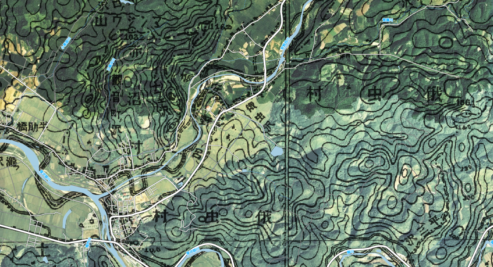

### 松前藩は水田適地にお城を建てたのか？

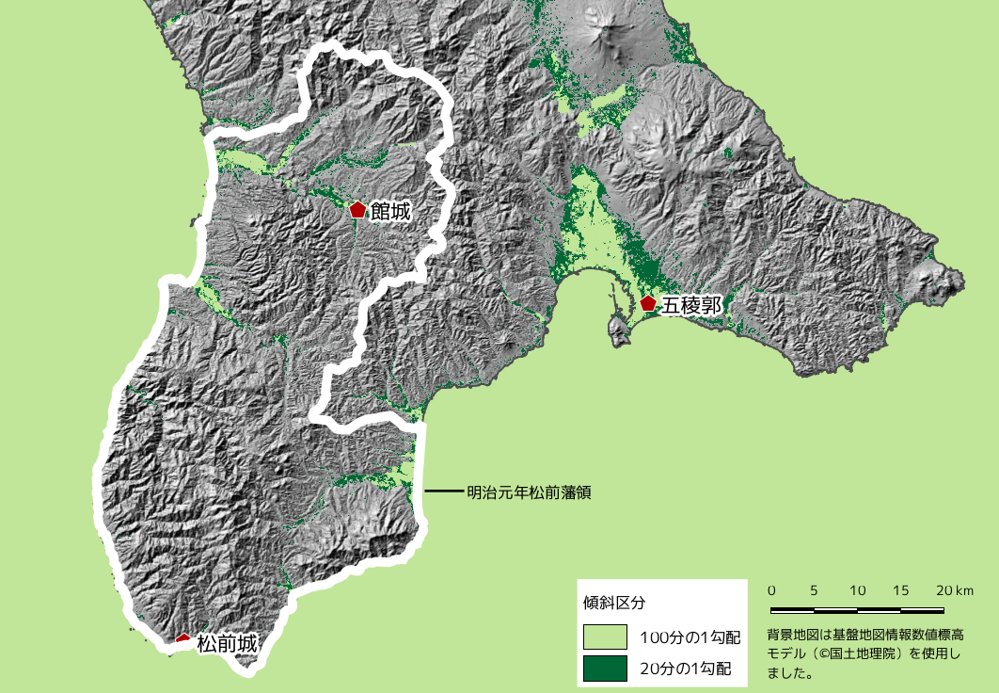

### 統計的な処理

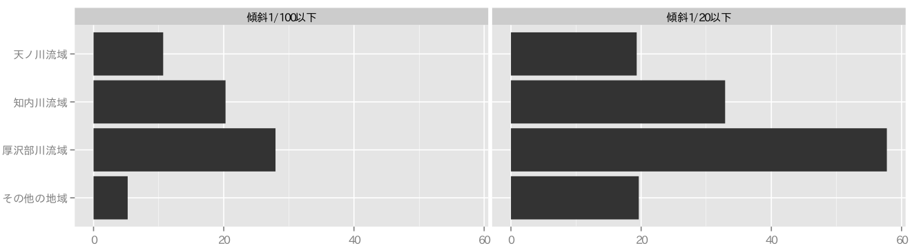

### ベクタとラスタ

- ベクタ＝幾何学的なデータ
	- イラストレーターっぽい
- ラスタ＝画像データ
	- フォトショップっぽい

---
### ベクタデータの種類

- ポイント＝点データ
- ライン　＝線データ
- ポリゴン＝面データ

通常、3種のデータは同一ファイルに混在できない

### ベクタデータのファイル形式

- Shapefile
- Spatialite
- GPX
- CSV
- GeoJson

### Shapefile

- ESRI社のフォーマット
- デファクトスタンダード
- データベースとしては古い構造（.dbf）を維持している
- GISでのトラブルの多くがシェープファイルに由来している側面もある

### Spatialite

- データベースエンジンにSQliteを使用
- シンプル・軽量・高機能
- ポストシェープファイル

### GPX

- GPSで使われるファイル形式
- GISにインポートした後は別のファイルに変換することが一般的

### CSV

- カンマ区切りテキスト
- x座標とy座標があればGISデータとして使える
- 表計算ソフトで扱えるシンプル極まりない構造
- ポイントデータしか表現できない

### GeoJson

- Javascriptをベースにつくられたデータ格納形式
- JSONのGIS版

### ポストShapeはどうなる？

- これまではShape形式がスタンダード
- ウェブ系のエンジニアやデータベースの専門家が地理情報システムを扱うことが増えた
	- 用途に応じた様々な形式のデータが登場
- 「とりあえずShape」という時代ではなさそう
- 用途に応じたファイル形式選択

---
### ラスタデータ

- 形式的には画像ファイル（.tif）
- 数値行列と「絵」的なデータ

### 絵的なラスタデータ（Landsat）

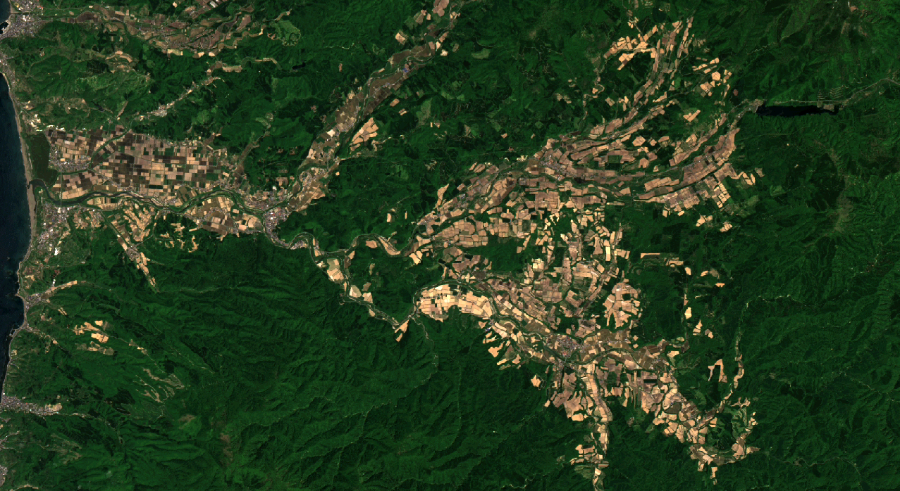
（The source data was downloaded from AIST's Landsat-8 Data Immediate Release Site, Japan（http://landsat8.geogrid.org/）.  Landsat 8 data courtesy of the U.S. Geological Survey.）

### データ行列（数値標高モデル）

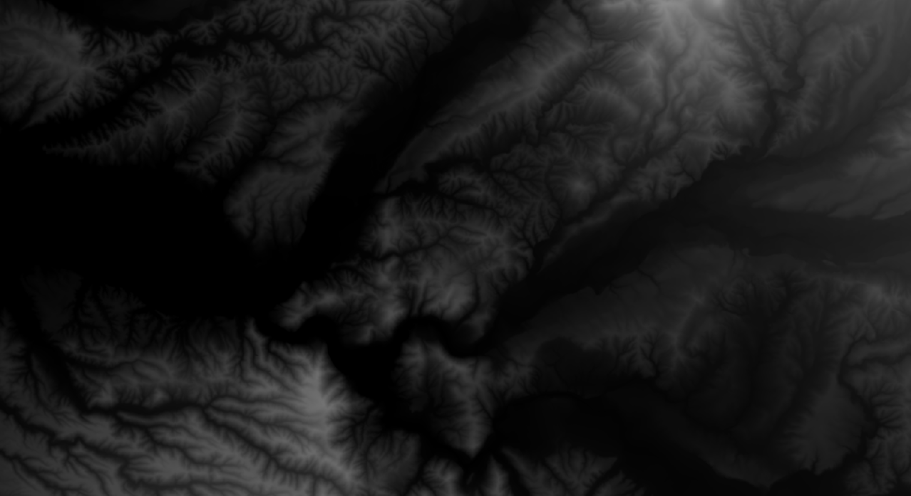

### データ行列（数値標高モデル）

### 衛星画像＋傾斜区分＋陰影図

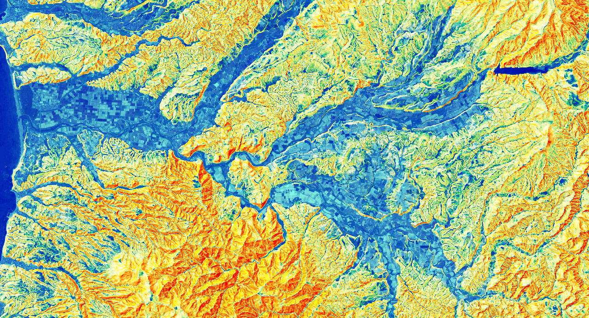
（Landsat及び数値標高モデルを使用）

### 微地形判読に特化したCS立体図

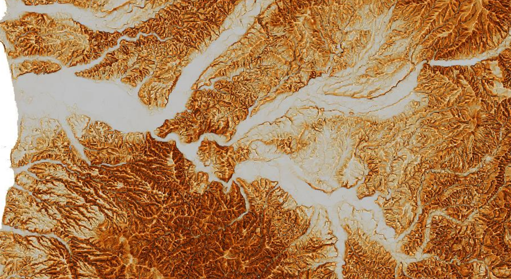
（北海道CS立体図（国土地理院承認番号　平28情使、 第830号））

## 測地系と座標系

- 測地系＝地球の形
- 投影系＝球体の平面展開方法
- 座標系＝基準点と基準線

### 2000年に新測地系導入

- ベッセル楕円体→GSR楕円体
- 日本測地系→世界測地系
- Tokyo Datum→JGD2000

### GISでの測地系・座標系の表現

- 測地系＋投影系＋座標系
- 緯度経度系→JGD2000
- 世界測地系平面直角座標11系→JGD2000/Japan Plane Rectanglar11
- 日本測地系UTMzone54→Tokyo/UTM zone54N

### 発掘調査成果は世界測地系

- 測量法第1条の規定により公共団体が費用を負担する測量は測量法の規定に従わなければならない。
- 同法第11条2項の規定により、公共測量は世界測地系で測定しなければならない。
- 国土地理院発行『公共測量の手引』によれば、文化財調査にともなう空中写真撮影、レーザー測量、現況図作成は公共測量に位置づけられる。

### 投影系は平面直角座標系

- 緯度経度系はGISでは扱いにくい。
	- 空間演算処理がうまくいかない。
- UTM投影系は比較的広範囲を扱うのに優れているといわれる。
- 自治体で一番普及しているのは平面直角座標系

### 抄録には緯度経度系を記載

- 遺跡のほぼ中心と思われる位置
- 度分秒で記載
- 2万5千分1地形図を目視

### 「地理院地図」による座標取得

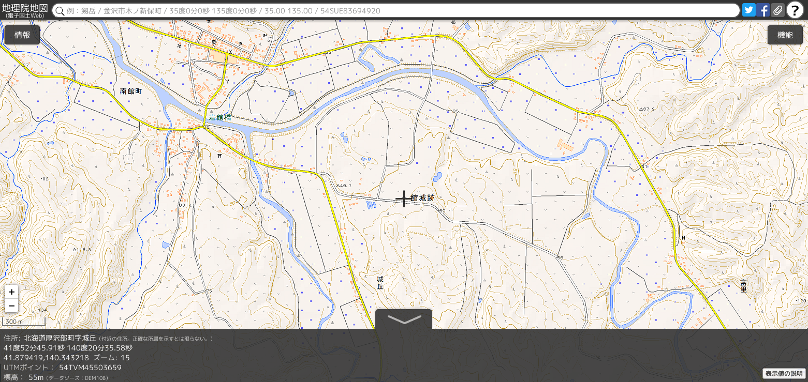

## GISに関するアンケート

- 専門性・職種
- GISへの興味
- GISの利用頻度
- 使用したことのあるGISソフトウェア
- GISで行ったことのある作業
- GISで行ってみたい作業
- GISを導入する上で障害となること

### 回答者の概要

- 北海道博物館協会学芸職員部会会員へのメーリングリスト
- facebook及びTwitter
- 有効回答数は145件
- 学芸職員やGIS系イベントで知り合った個人

### 考古歴史系は少し興味が少なめ

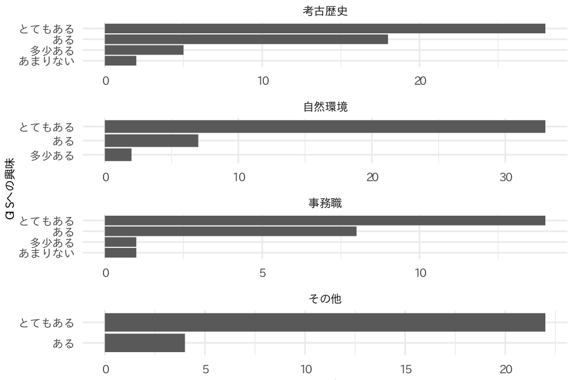

### 利用頻度も考古歴史系は少ない

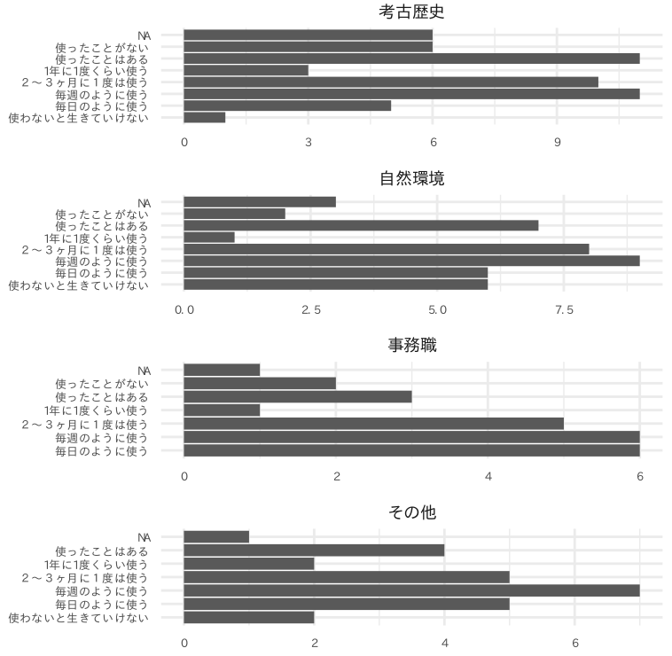

### 1位QGIS、2位カシミール、3位ArcGIS

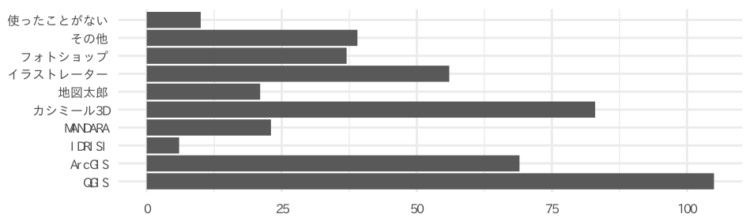

### 分析的な作業のニーズは高いが・・・

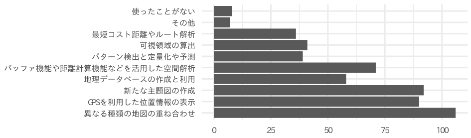

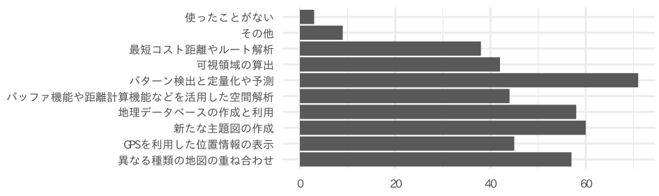

### 習得コストの高さがネック

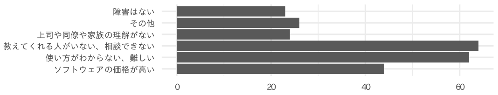

### アンケートまとめ

- 考古歴史系はGISの普及は今一つ
- スマホ内臓のGPS機能の利用は増加しているはず
- QGISがスタンダードの地位を確立しつつある
- 高度な分析のネックは数学的素養
- 導入コストは下がっている

### システム強靭化の影響

- ソフトウェアやプラグイン、データのダウンロードができるのか
- タイルレイヤの利用はできるのか

